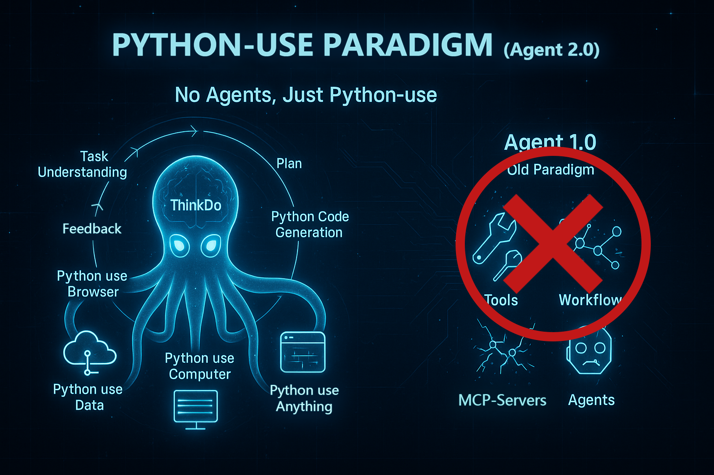
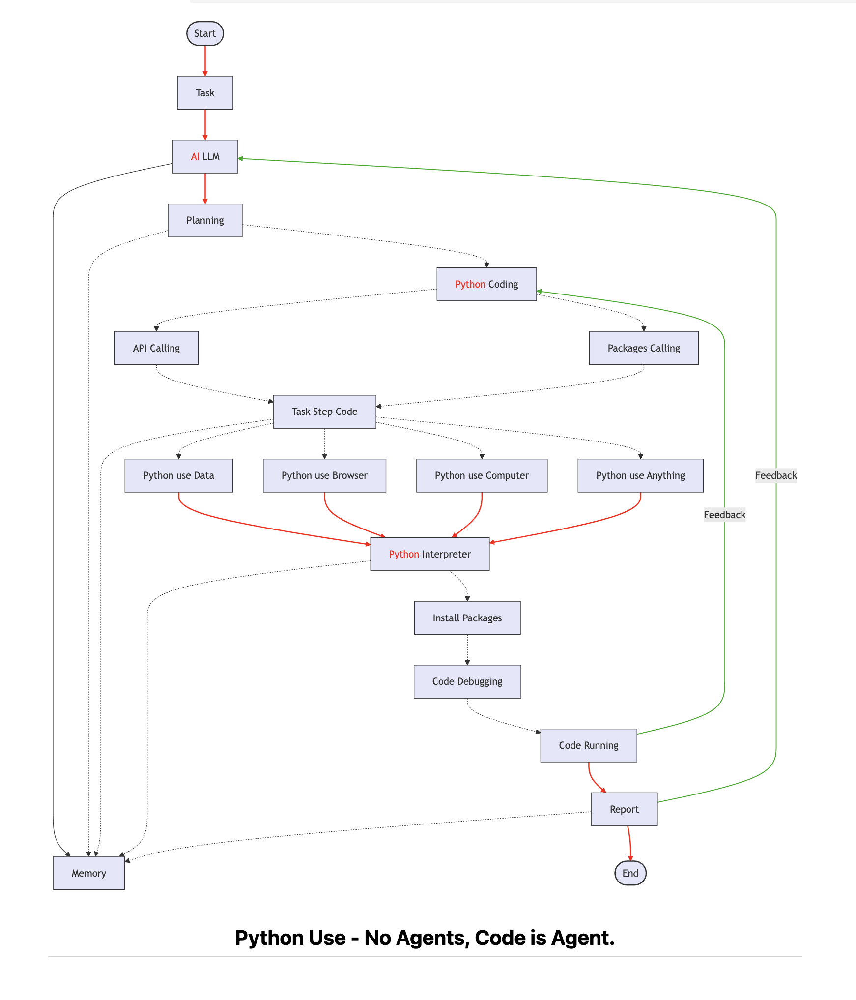

# Python-Use：一个全新的 AI Agent 范式（Agent 2.0） 🔗 [View on GitHub](https://github.com/knownsec/aipyapp)  🔗 [EN](https://github.com/knownsec/aipyapp/blob/main/docs/README.md)

## 背景：传统“假肢式”AI Agent模式已过时

传统 AI 模式（Agent 1.0）依赖于 Function Calling、Tools、MCP-Servers、Workflows 及各种插件客户端，不仅门槛高、成本高，而且严重依赖开发者生态。这些外接“假肢”之间难以协同，模型生成的代码还被限制在云端沙盒，无法真正接触环境，导致 AI 行动能力受限。

我们急需一种全新的范式，打破这一困局，实现 AI 与环境的深度连接，真正释放其原生执行潜能，迈向 AI Think Do 时代。

## 新范式登场：Python-use = LLM + Python Interpreter

Python-Use 是一种面向任务结果的新型智能执行范式，它通过将大模型与 Python 解释器深度结合，构建起“任务 → 计划 → 代码 → 执行 → 反馈”的完整闭环流程。

虽然该模式理论上支持任意编程语言，但我们选择 Python，是因为它具备：

- 强大的生态系统，覆盖数据处理、系统控制、自动化、AI 等多个维度；
- 简洁的语法和高度的可解释性，便于模型生成和调试；
- 模型原生对 Python 具备高熟悉度和调用效率。

这使得模型具备两大关键能力：

- **API Calling**：模型自动编写并执行 Python 代码调用 API，实现服务间互通；
- **Packages Calling**：模型自主选择并调用 Python 生态中的丰富库，实现通用任务编排。

用户只需提供简单的 API Key 或任务描述，模型即可自动完成整个流程，无需工具链配置或插件接入，彻底摆脱传统 Workflow 与 Function Calling 的繁琐。

特别强调：**Python-Use 并不是一个“代码生成工具”或“智能 IDE”**，而是一个任务驱动、结果导向的 AI Agent。

对用户而言，Python-Use 就是一个“描述任务 → 自动完成 → 直接返回结果”的智能体系统：

- 用户无需掌握任何编程知识；
- 模型会自动完成理解、规划、编程、调试与结果生成；
- 自动修复 bug，持续优化方案，保障任务高质量完成。

代码只是模型实现目标的手段，最终交付的是任务完成的结果，而非中间的代码过程。

## 技术主张：No Agents, Code is Agent

Python-Use 开启了一条全新的智能行动路径：**No Agents、No MCP、No Workflow、No Clients...**

它摒弃了传统 AI 对外部工具、协议和执行层的依赖，转而让模型用代码直接控制环境。我们称之为：**No Agents，Code is Agent**。

借助 Python，模型可以完成以下能力：

- **Python use Data**：操作与分析数据
- **Python use Browser**：浏览器自动化
- **Python use Computer**：文件系统与本地环境控制
- **Python use IOT**：设备交互与系统集成
- **...**
- **Python use Anything**：代码通向一切

流程图

这一范式还意味着：

- **No MCP**：无需统一协议，代码即协议、代码即标准；
- **No Workflow**：无需预设流程，模型自主规划执行；
- **No Tools**：不再依赖插件注册，模型直接调用生态工具；
- **No Agents**：无需外部代理，模型通过代码直接完成任务。

它真正建立起 LLM 与真实环境的通用通信桥梁，释放出模型的执行力与行动潜能。

## 统一入口：No Clients, Only AiPy

AI 执行不再需要繁杂客户端与套壳应用，用户只需运行一个 Python 环境：**AiPy**。

- **统一终端**：所有交互归于 Python 解释器
- **极简路径**：无需安装多个 Agent 或插件，入口统一、体验一致
- **AiPy**：https://www.aipy.app/

## 模式升级：AI ThinkDo = 真正的知行合一

- **任务**：用户用自然语言表达意图；
- **计划**：模型自动分解并规划执行路径；
- **代码**：生成最优 Python 方案；
- **执行**：直接与真实环境交互并完成动作；
- **反馈**：获取结果、分析偏差、自动调整。

模型具备从认知到行动、从计划到反思的全流程能力，不再依赖外部 Agent，真正释放 AI 自主行动力。

## 自我进化：多模型能力融合

AI 的演化已不再局限于语言模型，而是向多模态、多能力融合迈进。

- 融合视觉模型，实现图像与视频理解；
- 融合语音模型，实现听觉输入与语音输出；
- 融合专家模型，增强专业知识处理能力；
- 所有能力统一由模型中枢调度，自我驱动、自我反馈、自我演进。

这是从“对话智能体”到“统一智能行动体”的跃迁之路，迈向真正的 AGI。

## 愿景：解放 AI 通往 AGI

Python-Use 不仅是一个技术方案，更是一种面向未来的 AI 哲学与实践路径：

**The Model is the Product → The Model is the Agent → No Agents, Code is Agent → Just Python-use → Freedom AI（AGI）**

它让 AI 从“只会说话”走向“主动执行”，从依赖工具走向独立完成，真正释放大模型的智能生产力，迈向通用智能。

现在就加入我们，让 AI 从束缚中觉醒，真正释放执行力，融入世界、创造价值！

**The real general AI Agent is NO Agents!** 

**No Agents, Just Python-use！**
